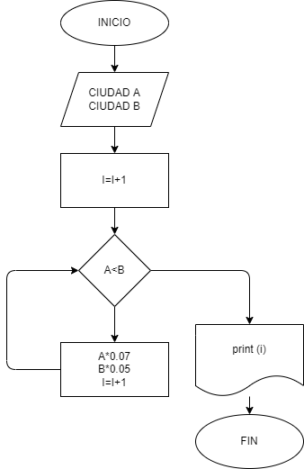

# Ciudad-a-y-b
En 1980 la Ciudad a tenia 3.500.000 de habitantes y una rata de crecimiento del 7%  anual; y la ciudad b tenía 5.000.000 y una rata del crecimiento del 5% anual. si el crecimiento se mantiene constante en las dos ciudades hacer el diagrama de flujo y el programa en pýthon que calcule e imprima  en que año la población de la ciudad a es mayor que la de la ciudad b
## Diagrama de flujo
(Diagrama de flujo)